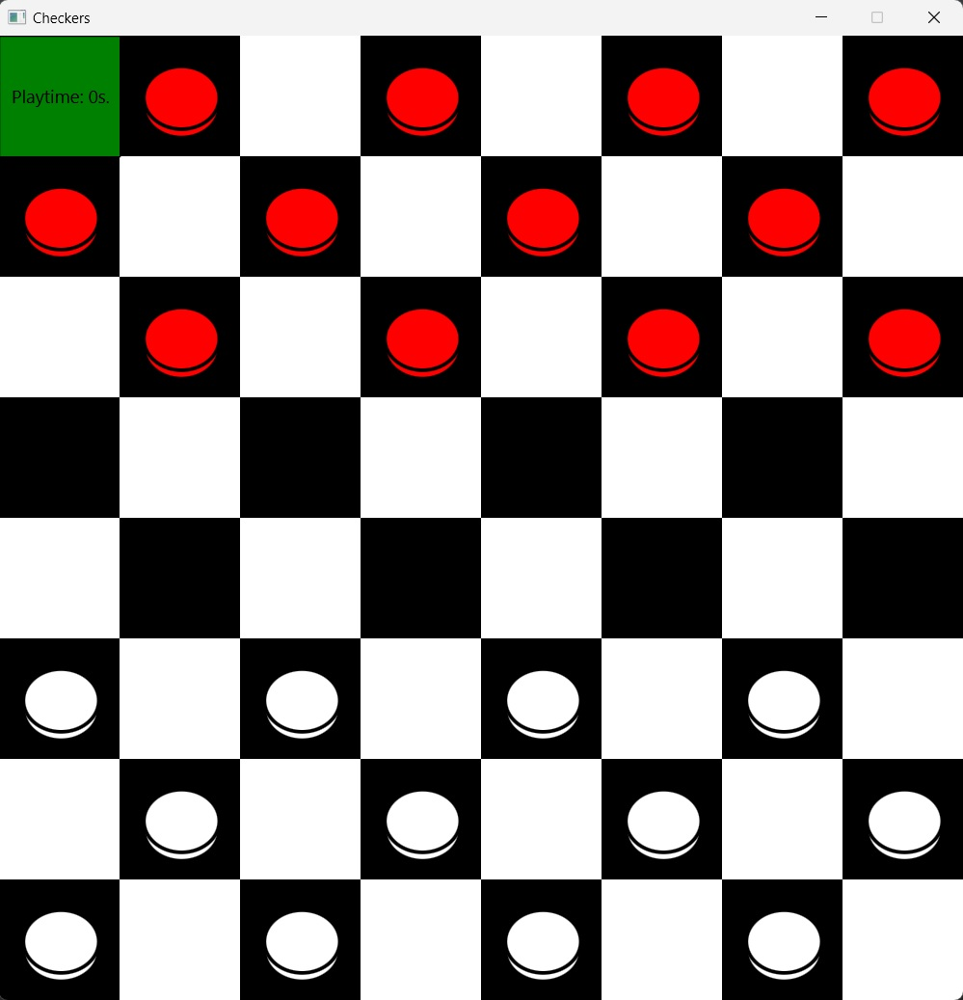

# checkers-javafx-sockets

Popular game of checkers written in Java with 
- sockets
- JavaFX

## App preview

## How to play?
Game has two modes of play
1. Player vs player
2. Player vs BOT

How to start game:

- Run a server located in (src/Server/ServerMain.java)
- Run a Checkers.java file with argument "1/2":
-  "1" - White
-  "2" - Red
